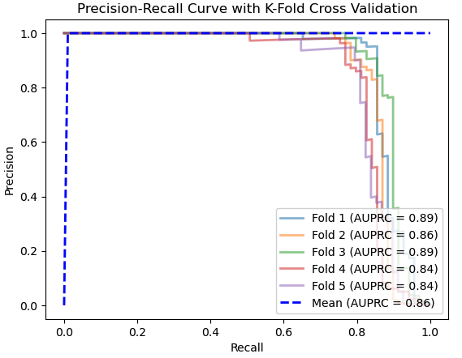

# Model Card

See the [example Google model cards](https://modelcards.withgoogle.com/model-reports) for inspiration. 

## Model Description

**Input:** 
- The model takes 30 input features: V1 to V28, Time, and Amount.
- These features are the principal components obtained via PCA, except for Time and Amount.

**Output:** 
1. The model outputs a binary classification:
  - 1 indicating a fraudulent transaction.
  - 0 indicating a non-fraudulent transaction.

**Model Architecture:** 
- The model is an XGBoost classifier, which was trained with rebalanced data via SMOTE.
- Hyperparameters used in the final model were fine-tuned with RandomizedSearchCV with KFold=5:
    1. Learning rate: dynamically tuned = **0.3**.
    2. Number of estimators: dynamically tuned = **300**.
    3. Max depth: dynamically tuned = **5**.
    4. Subsample: dynamically tuned = **0.9**.
    5. Colsample_bytree: dynamically tuned = **1.0**.

## Performance

The primary metric used to evaluate the model's performance is the Area Under the Precision-Recall Curve (AUPRC). This metric is well-suited for imbalanced classification problems like fraud detection, where the positive class (fraudulent transactions) is significantly less frequent than the negative class.

**Performance Metrics:**
- Area Under the Precision-Recall Curve (AUPRC): 0.89
- Precision: 0.97
- Recall: 0.88

**Performance Summary:**
- The model was evaluated using k-fold cross-validation.
- The mean AUPRC across all folds was approximately 0.86.
- The precision-recall curve shows the balance between precision and recall for different thresholds.

**Performance Graph:**

## Limitations

- **Class Imbalance:** The model’s performance might degrade on datasets with a significantly different class imbalance ratio than the training set.
- **Data Dependency:** The model is trained on features that are principal components; applying the model to raw transaction data without similar preprocessing (PCA transformation) will not yield accurate results.
- **Temporal Changes:** The model may not adapt well to changes in transaction patterns over time without retraining.

## Trade-offs

- Precision vs. Recall: There is a trade-off between precision and recall. The chosen model parameters aim to balance both, but adjusting thresholds or retraining may be necessary depending on whether minimising false positives or false negatives is prioritised.
- Computational Complexity: XGBoost is computationally intensive, which can be a limitation for real-time fraud detection systems with limited resources.

## Summary

The model developed is a robust XGBoost classifier capable of detecting fraudulent transactions with high precision and recall, making it suitable for credit card fraud detection. However, to maintain its performance, careful consideration is needed regarding the class imbalance, preprocessing steps, and retraining frequency.
